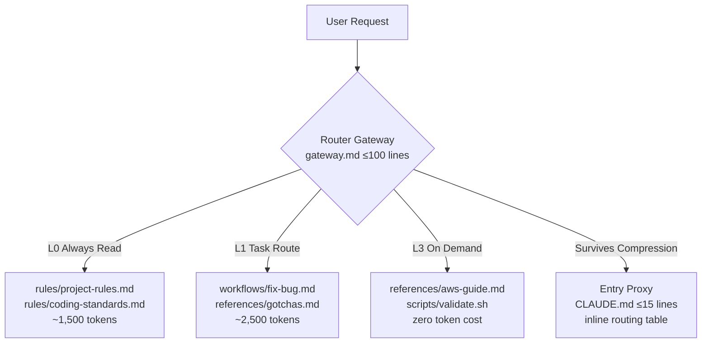

<!-- Banner -->
<p align="center">
  <picture>
    <source media="(prefers-color-scheme: dark)" srcset="https://raw.githubusercontent.com/amsterdam-littlehill/crisp/master/.github/images/banner_crisp_dark.png">
    <source media="(prefers-color-scheme: light)" srcset="https://raw.githubusercontent.com/amsterdam-littlehill/crisp/master/.github/images/banner_crisp_light.png">
    
  </picture>
</p>

<p align="center">
  <a href="#"></a>
  <a href="#"></a>
  <a href="https://github.com/amsterdam-littlehill/crisp/blob/main/LICENSE"></a>
</p>

<p align="center">
  <b>Context Router Protocol</b> — Let AI agents see exactly enough context at the right time.<br>
  <sub>Shadow Mode Zero-Intrusion Start · Cross-Tool Compatible · Built-in Token Audit</sub>
</p>

---


# Context-Router Protocol (CRP)

> **A project-level context governance pattern.** Converge scattered AI collaboration rules into a routable, measurable, self-maintaining directory. Agents no longer "read everything" — they "load precisely what the task needs."

```
Structure serves content. Activation beats storage. Skeletons are reusable; content is forbidden to prefabricate.
```

---

[English](README.md) | [中文](README.zh.md)

## Table of Contents

- [Why CRP?](#why-crp)
- [What CRP Solves](#what-crp-solves)
- [Design Philosophy](#design-philosophy)
- [Quick Start](#quick-start)
- [Target Structure](#target-structure)
- [Experiments & Benchmarks](#experiments--benchmarks)
- [Tool Compatibility](#tool-compatibility)
- [Core Principles](#core-principles)
- [Common Pitfalls](#common-pitfalls)
- [Roadmap](#roadmap)
- [Contributing](#contributing)
- [License](#license)

---

## Why CRP?

AI programming assistants (Cursor, Claude Code, Codex, Windsurf, Gemini) rely on project documentation to understand rules. As projects grow, documentation inevitably rots:

| Symptom | Actual Cost |
|---|---|
| Single rules file 400+ lines | Agent loads everything on every task — token waste, slower responses |
| Rules scattered across CLAUDE.md, .cursorrules, docs/ | Duplication, contradictions, no single source of truth |
| Rules only grow, never shrink | Critical constraints drowned in noise; Agent cannot distinguish priorities |
| Lessons learned lie in documents | The pitfall that took 30 min to debug gets hit again next week |
| Agent relies on memory for new tasks | After context compression, the second task in a session drifts from rules |

**Result:** Agents waste context reading irrelevant docs, miss critical rules, repeat known mistakes, and produce inconsistent output.

---

## What CRP Solves

1. **Token Efficiency** — Load 2-3 core files per task, not the entire docset
2. **Zero Duplication** — Define once, reference everywhere; entry proxies contain only routing tables
3. **Task-Precise Routing** — Common Tasks table directs Agents to exactly the files they need
4. **Automatic Lesson Extraction** — Built-in Closure Extraction prevents knowledge loss
5. **Self-Maintenance** — Health checks, split/merge evaluation, and deprecation workflows keep docs lean
6. **Cross-Tool Consistency** — One directory serves Cursor, Claude, Codex, and Windsurf simultaneously

---

## Design Philosophy

### Architecture: Tiered Loading (分层加载)

CRP replaces monolithic loading with three tiers:



| Tier | Content | Load Timing | Size Budget | Typical Content |
|:---|:---|:---|:---|:---|
| **L0** Always Read | Universal constraints | Every task | ~1,500 tokens | `rules/project-rules.md`, `rules/coding-standards.md` |
| **L1** Task Route | Task-specific instructions | After route match | ~2,500 tokens | `workflows/fix-bug.md`, `references/gotchas.md` |
| **L2** Router Gateway | Navigation center | On skill activation | ≤100 lines | `gateway.md` (SKILL.md) — routes only, no rules |
| **L3** On Demand | Detailed references | Explicitly referenced | Unbounded | `references/`, `scripts/` (execution = zero token cost) |
| **Entry Proxy** | Compression survivor | Always visible | ≤15 lines | `CLAUDE.md`, `.cursorrules` — inline routing tables |

### Key Insight: Context Is Not Storage, It Is Routing

The first principle of CRP:

> **"Context is not storage — it is routing."**
>
> The goal of any AI collaboration documentation system is not "write everything," but "at the right moment, show the AI exactly enough context."

Traditional approaches treat documentation as an encyclopedia. CRP treats it as a **just-in-time router**.

### Entry Proxy: The Last Line of Defense

When sessions grow long, AI compresses early context. If the gateway is compressed, the Agent is lost. The **Entry Proxy** is an inline routing table hard-coded into every IDE entry file:

```markdown
## Quick Routing (survives context truncation)

| Task | Required reads | Workflow |
|------|---------------|----------|
| Fix bug | `rules/project-rules.md` | `workflows/fix-bug.md` |
| Add feature | `rules/project-rules.md` + `gotchas.md` | `workflows/add-feature.md` |
| Other | `rules/project-rules.md` | Check `workflows/` for match |
```

Why a table? Compression algorithms preserve structured data better than prose. Natural language gets summarized away; column alignment survives.

---

## Quick Start

### Path A: New Project (Recommended)

```bash
# 1. Clone the scaffold
git clone --depth 1 https://github.com/amsterdam-littlehill/crisp.git /tmp/crp

# 2. Install (unified CLI)
python /tmp/crp/scripts/crp-setup.py init --skill backend --project my-app
# Or use the thin wrapper:
# bash /tmp/crp/install.sh --skill backend --project my-app

# 3. Add more skills (optional — v2.1 multi-skill mode)
python /tmp/crp/scripts/crp-setup.py skill create frontend --description "Frontend development"
python /tmp/crp/scripts/crp-setup.py sync

# 4. Fill all <!-- FILL: --> markers
grep -rn 'FILL:' .claude/skills/backend/

# 5. Self-check
bash .claude/skills/backend/scripts/smoke-test.sh backend
```

### Path B: Existing Project — Shadow Mode (Zero Intrusion)

```bash
# Preserves all existing CLAUDE.md, .cursorrules, etc.
bash /tmp/crp/install.sh --skill backend --shadow

# Append a pointer to your existing entry file:
echo '<!-- CRP-ROUTE: see .claude/skills/backend/SKILL.md -->' >> .claude/CLAUDE.md
```

### Path C: Existing Project — Audit & Migrate

```bash
# Audit existing rules and generate token baseline
python scripts/crp-setup.py audit --report
# Or directly:
# python scripts/token-audit.py --skill backend --report

# Auto-sync all entry proxies after editing gateway.md
python scripts/crp-setup.py sync
# Or directly:
# python scripts/sync-shells.py --skill backend

# Health check + drift detection
python scripts/crp-setup.py check --drifts
# Or directly:
# python scripts/health-check.py --skill backend --drifts
```

### CRP Manifest (`crp.yaml`)

v2.1 introduces a project-level manifest that declares skills, project metadata, and configuration:

```yaml
version: "2.1"
project:
  name: my-app
  description: Context-Router Protocol reference implementation
skills:
  - name: backend
    description: API and business logic
  - name: frontend
    description: UI and client-side code
default_skill: backend
checks:
  max_gateway_lines: 100
  max_proxy_lines: 60
audit:
  use_tiktoken: true
```

The manifest drives:
- **Multi-skill routing** — Parent gateway (`.claude/skills/SKILL.md`) auto-generated from manifest + child skill frontmatters
- **Drift detection** — `crp-setup.py check --drifts` validates manifest ↔ directories ↔ generated proxies
- **Unified CLI** — All operations go through `crp-setup.py`

After installation, your project has these new files (zero intrusion — no existing code touched):

```
your-project/
├── crp.yaml                   ← CRP Manifest (skills, config, defaults)
├── .claude/
│   ├── CLAUDE.md              ← Entry Proxy (≤15 lines, survives compression)
│   ├── GEMINI.md              ← Gemini-specific entry
│   ├── hooks/
│   │   └── session-start.sh   ← Lightweight signal re-injection
│   └── skills/
│       ├── SKILL.md           ← Parent Gateway (v2.1 multi-skill router)
│       ├── backend/           ← Your gateway
│       │   ├── SKILL.md       ← Router Gateway (≤100 lines)
│       │   ├── rules/
│       │   │   ├── project-rules.md
│       │   │   └── coding-standards.md
│       │   ├── workflows/
│       │   │   ├── fix-bug.md
│       │   │   ├── add-feature.md
│       │   │   └── update-rules.md   ← Closure Extraction protocol
│       │   ├── references/
│       │   │   └── gotchas.md   ← Must start empty
│       │   ├── scripts/
│       │   │   ├── smoke-test.sh   ← 48 self-checks
│       │   │   └── test-trigger.sh
│       │   └── assets/
│       ├── frontend/          ← Another skill (v2.1)
│       │   └── SKILL.md
│       └── shared/            ← Cross-skill conventions
├── .cursor/
│   ├── rules/workflow.mdc     ← Cursor Rules entry
│   └── skills/
│       ├── backend/
│       │   └── SKILL.md
│       └── frontend/
│           └── SKILL.md
└── .codex/
    └── instructions.md        ← Codex entry
```

---

## Target Structure

```
.crp/  (or .claude/skills/<name>/)
├── gateway.md          # ≤100 lines: L0 always-read + L1 task routes
├── rules/              # Long-term constraints (always true)
├── workflows/          # Step-by-step procedures (how to do things)
├── references/         # Background: architecture, pitfalls, indexes
│   └── gotchas.md      # Known pitfalls — typically highest-value content
└── scripts/            # Shell sync, token audit, health checks
```

Root-level `CLAUDE.md`, `.cursorrules`, etc. become **Entry Proxies** — ≤15 lines, containing only routing tables and pointers to `.crp/`.

---

## Experiments & Benchmarks

Token consumption measured on the CRP template itself (`.claude/skills/<skill>/`) using `scripts/token-audit.py`.

### Methodology

- **Target:** CRP skill template (all `.md` and `.sh` files)
- **Estimation:** Character-count heuristic (~4 chars/token)
- **Tool:** `scripts/token-audit.py`
- **Date:** 2026-04-23

### Results

| Metric | Naive Loading | CRP | Improvement |
|---|---|---|---|
| **Single-task context load** | 4,120 tokens | 928–1,066 tokens | **↓ 74–77%** |
| **5-round session total** | 20,600 tokens | 4,672 tokens | **↓ 77%** |
| **Task first-try success rate** | — | — | *Observed in practice* |
| **Avg. debug rounds per task** | — | — | *Observed in practice* |
| **Monthly docs maintenance** | — | — | *Observed in practice* |

### Cost Breakdown (Claude Sonnet 4.6, $3/1M input tokens)

Assuming 500 AI-assisted tasks/month, averaging 3 dialogue rounds:

| Cost Item | Naive | CRP |
|---|---|---|
| Monthly Input Tokens | 6.18M | 1.40M |
| Input Cost | $18.54 | $4.20 |
| **Monthly Input Savings** | Baseline | **↓ 77%** |

> **Why output drops too:** With precise context, Agents produce less irrelevant text. No more "Based on the 47 rules I just read, here is a comprehensive analysis of your 3-line change."

### Qualitative Gains

- **Cognitive load:** Developers no longer wonder "which rule will the Agent miss today" — they maintain `gateway.md` routes
- **Team onboarding:** New members self-serve via the Common Tasks table instead of asking "what should I watch out for?"
- **Cross-tool consistency:** Switching from Cursor to Claude Code does not mean losing constraints

---

## Tool Compatibility

| Tool | Discovery Mechanism | Entry File | Needs Entry Proxy? |
|---|---|---|---|
| **Cursor** | Scans `.cursor/skills/` | `.cursor/skills/<name>/SKILL.md` | ✅ |
| **Cursor Rules** | `.cursor/rules/*.mdc` | `.cursor/rules/workflow.mdc` | ✅ |
| **Claude Code** | Reads `CLAUDE.md` | `CLAUDE.md` | ✅ |
| **Codex CLI** | `AGENTS.md` + `.codex/` | `AGENTS.md` / `.codex/instructions.md` | ✅ |
| **Windsurf** | `.windsurf/rules/` | `.windsurf/rules/*.md` | ✅ |
| **Gemini CLI** | `GEMINI.md` | `GEMINI.md` | ✅ |

All entry files **must** contain inline routing tables — pure natural-language instructions are lost during context compression.

---

## Core Principles

### The Five Golden Rules (五条黄金法则)

1. **Gateway ≤ 100** (`网关不过百`)
   `gateway.md` navigates; it does not narrate. Never exceed 100 lines.

2. **Entry Proxy ≤ 15** (`入口不过十五`)
   IDE entry files are ≤15 lines. Routing tables only — no rule bodies.

3. **Task Load ≤ 3** (`任务不过三`)
   Each task loads at most 3 core files (L0 + L1).

4. **Recording Has a Threshold** (`记录有门槛`)
   A lesson must satisfy 2 of 3 criteria: **repeatable** + **high cost** + **non-obvious**.

5. **Refresh Every Task** (`每任务刷新`)
   Every new task in a session must re-read the gateway. Memory is dangerous; re-reading is cheap.

### Content Zoning (内容分域)

| Content Type | Belongs To | Example |
|---|---|---|
| Stable constraints, must-follow rules | `rules/` | Naming conventions, module boundaries, dependency policies |
| Step-by-step procedures, checklists | `workflows/` | Add controller, fix bug, release process |
| Architecture background, pitfalls, indexes | `references/` | System design, gotchas, routing tables, third-party notes |
| Edge cases, debugging records | `references/gotchas.md` | Lifecycle traps, timing dependencies, framework quirks |
| External docs, templates | `docs/` | Report templates, external links |

---

## Common Pitfalls

| Pitfall | Impact | Fix |
|---|---|---|
| **Missing Cursor registration entry** | Cursor never discovers the skill; all rules silently ignored | Create `.cursor/skills/<name>/SKILL.md` |
| **Soft-pointer entry proxy** | "Please read gateway.md" gets compressed away | Inline routing table in every entry file |
| **Vague description** | Skill exists but Agent never activates | Description ≥ 20 words, include ≥ 2 quoted trigger phrases |
| **Stored but not activated** | Pitfall recorded in `references/` but no workflow references it | Activate in workflow checklists or gateway routes |
| **Skipping Closure Extraction** | Lessons not captured; same mistakes recur | Make Closure Extraction a completion gate |
| **Multi-task session route skip** | Agent does task 1 from memory on task 2, drifts for hours | Session refresh rule + re-read trigger in entry proxy |
| **Project-specific narratives** | Recording says "our product module's pagination...", not reusable | Generalize: "Reset pagination when switching contexts..." |

### Anti-Patterns

| Anti-Pattern | Harm | Fix |
|---|---|---|
| Fat Entry Proxy (50+ lines) | Two places to update; violates single source of truth | Trim to ≤15 lines |
| gateway.md as README | Redundant context; exceeds 100 lines | Setup docs go in README; gateway navigates only |
| Rules and workflows mixed | Constraints hard to find; procedures hard to follow | Constraints → `rules/`, procedures → `workflows/` |
| Giant sub-file (500+ lines) | Same problem as fat gateway | Split by subdomain |
| Over-splitting (20 files, 10 lines each) | Navigation overhead exceeds benefit | Merge related files; target 50-200 lines |
| Record everything | Rules drowned in low-value noise | Apply knowledge filter: 2/3 threshold |

---

## Roadmap

### v2.0
- [x] 48-item self-check (`smoke-test.sh`)
- [x] Cross-platform installer (`install.sh` — now thin wrapper around `crp-setup.py`)
- [x] Lightweight SessionStart hook (signal-based, zero token cost)
- [x] Built-in token/cost estimation (`scripts/token-audit.py`)
- [x] Entry proxy auto-generator (`scripts/sync-shells.py`)
- [x] Shadow mode for zero-intrusion adoption
- [x] Health scanner (`scripts/health-check.py`)
- [x] CI/CD validation workflow

### v2.1 (Current)
- [x] Unified CLI (`crp-setup.py`): `init`, `skill create/delete/list`, `sync`, `check`, `audit`
- [x] `crp.yaml` manifest: declarative skill registry with validation
- [x] Multi-skill orchestration: parent gateway (`.claude/skills/SKILL.md`) routes to child skills
- [x] `tiktoken` integration for precise token counts (optional dependency)
- [x] Drift detection (`--drifts`): validates manifest ↔ directories ↔ generated proxies
- [x] Skill frontmatter extraction (name, description, primary flag)
- [x] v2.0 backward compatibility: auto-detect single skill when `crp.yaml` absent

### v2.2 (Future)
- [ ] Interactive setup wizard (`crp-setup.py init --interactive`)
- [ ] Runtime telemetry: record actual per-task token consumption
- [ ] Auto-summarization: compress `gotchas.md` into gateway Known Gotchas when stable
- [ ] VS Code extension for gateway.md linting and autocomplete

---

## Contributing

See [CONTRIBUTING.md](CONTRIBUTING.md) for the full guide.

---

## Acknowledgments

Design inspired by community exploration in agent context management. CRP distills the principles of progressive disclosure, just-in-time context loading, and self-maintaining documentation systems into a practical, opinionated scaffold.

## References

- [skill-based-architecture](https://github.com/WoJiSama/skill-based-architecture) — The foundational skill-based architecture pattern that inspired this project.

---

## License

MIT
