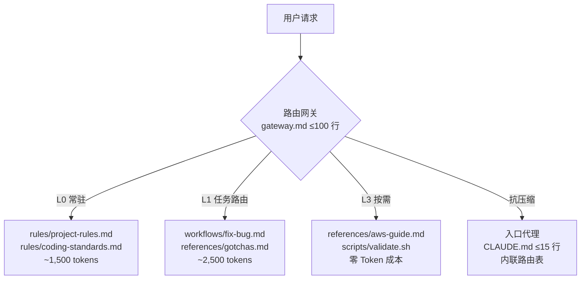

<!-- Banner -->
<p align="center">
  <picture>
    <source media="(prefers-color-scheme: dark)" srcset="https://raw.githubusercontent.com/amsterdam-littlehill/crisp/master/.github/images/banner_crisp_dark.png">
    <source media="(prefers-color-scheme: light)" srcset="https://raw.githubusercontent.com/amsterdam-littlehill/crisp/master/.github/images/banner_crisp_light.png">
    
  </picture>
</p>

<p align="center">
  <a href="#"></a>
  <a href="#"></a>
  <a href="https://github.com/amsterdam-littlehill/crisp/blob/main/LICENSE"></a>
</p>

<p align="center">
  <b>渐进式上下文路由协议</b> —— 让 AI 代理在正确的时机，看到恰好足够的上下文。<br>
  <sub>Shadow Mode 零侵入起步 · 跨工具兼容 · 内置 Token 审计</sub>
</p>

---


# 上下文路由协议 (CRP) 

> **项目级上下文治理模式。** 将散落在各处的 AI 协作规则收敛为一个可路由、可度量、自维护的目录结构。Agent 不再"通读全文"，而是"按任务精准加载"。

```
结构服务于内容，激活优于存储，骨架可复用，内容禁止预制。
```

---

## 目录

- [为什么需要 CRP？](#为什么需要-crp)
- [CRP 解决什么？](#crp-解决什么)
- [设计理念](#设计理念)
- [快速开始](#快速开始)
- [目标结构](#目标结构)
- [实验与基准](#实验与基准)
- [工具兼容性](#工具兼容性)
- [核心原则](#核心原则)
- [常见陷阱](#常见陷阱)
- [路线图](#路线图)
- [贡献指南](#贡献指南)
- [致谢与参考](#致谢与参考)
- [许可证](#许可证)

---

## 为什么需要 CRP？

AI 编程助手（Cursor、Claude Code、Codex、Windsurf、Gemini）依赖项目文档来理解规则。随着项目增长，文档不可避免地腐化：

| 症状 | 实际代价 |
|---|---|
| 单个规则文件 400+ 行 | Agent 每次任务都全读 —— Token 浪费、响应变慢 |
| 规则散落在 CLAUDE.md、.cursorrules、docs/ | 重复、矛盾、没有单一真相源 |
| 规则只增不减 | 关键约束被噪音淹没；Agent 无法区分优先级 |
| 经验教训躺在文档里 | 调试 30 分钟才发现的陷阱，下次照样踩 |
| Agent 凭记忆做新任务 | 上下文压缩后，同一会话的第二个任务偏离规则 |

**结果：** Agent 浪费上下文读无关文档、遗漏关键规则、重复已知错误、输出不一致。

---

## CRP 解决什么？

1. **Token 效率** —— 每次任务只加载 2-3 个核心文件，而非全部文档
2. **零重复** —— 一处定义，多处引用；入口代理只包含路由表
3. **任务精准路由** —— Common Tasks 表 directing Agent 到恰好需要的文件
4. **经验自动萃取** —— 内置 Closure Extraction，防止知识流失
5. **自维护** —— 健康检查、拆分/合并评估、废弃流程保持文档精简
6. **跨工具一致** —— 一个目录同时服务 Cursor、Claude、Codex、Windsurf

---

## 设计理念

### 架构：分层加载（Tiered Loading）

CRP 用三层结构取代单体加载：



| 层级 | 内容 | 加载时机 | 大小预算 | 典型内容 |
|:---|:---|:---|:---|:---|
| **L0** 常驻 | 通用约束 | 每次任务 | ~1,500 tokens | `rules/project-rules.md`, `rules/coding-standards.md` |
| **L1** 任务路由 | 任务专属指令 | 路由匹配后 | ~2,500 tokens | `workflows/fix-bug.md`, `references/gotchas.md` |
| **L2** 路由网关 | 导航中心 | 技能激活时 | ≤100 行 | `gateway.md` (SKILL.md) — 只导航，无规则 |
| **L3** 按需 | 详细参考 | 显式引用时 | 无限制 | `references/`, `scripts/`（执行 = 零 Token 成本） |
| **入口代理** | 压缩幸存者 | 始终可见 | ≤15 行 | `CLAUDE.md`, `.cursorrules` — 内联路由表 |

### 核心洞察：上下文不是存储，而是路由

CRP 的第一原理：

> **"上下文不是存储 —— 它是路由。"**
>
> 任何 AI 协作文档系统的目标不是"写全"，而是"在正确的时机，让 AI 看到恰好足够的上下文"。

传统方式把文档当百科全书。CRP 把它当作**即时路由器**。

### 入口代理：最后一道防线

当会话变长，AI 会压缩早期上下文。如果网关被压缩，Agent 就迷路了。**入口代理**是硬编码在每个 IDE 入口文件中的内联路由表：

```markdown
## 快速路由（抗上下文截断）

| 任务 | 必读文件 | 工作流 |
|------|---------|--------|
| 修复 Bug | `rules/project-rules.md` | `workflows/fix-bug.md` |
| 添加功能 | `rules/project-rules.md` + `gotchas.md` | `workflows/add-feature.md` |
| 其他 | `rules/project-rules.md` | 检查 `workflows/` 是否有匹配 |
```

为什么是表格？压缩算法对结构化数据的保留优于散文。自然语言被摘要掉；列对齐幸存。

---

## 快速开始

### 路径 A：新项目（推荐）

```bash
# 1. 克隆脚手架
git clone --depth 1 https://github.com/amsterdam-littlehill/crisp.git /tmp/crp

# 2. 安装（统一 CLI）
python /tmp/crp/scripts/crp-setup.py init --skill backend --project my-app
# 或使用包装脚本：
# bash /tmp/crp/install.sh --skill backend --project my-app

# 3. 添加更多技能（可选 —— v2.1 多技能模式）
python /tmp/crp/scripts/crp-setup.py skill create frontend --description "Frontend development"
python /tmp/crp/scripts/crp-setup.py sync

# 4. 填充所有 <!-- FILL: --> 标记
grep -rn 'FILL:' .claude/skills/backend/

# 5. 自检
bash .claude/skills/backend/scripts/smoke-test.sh backend
```

### 路径 B：存量项目 —— Shadow Mode（零侵入）

```bash
# 保留所有现有 CLAUDE.md、.cursorrules 等
bash /tmp/crp/install.sh --skill backend --shadow

# 在现有入口文件末尾追加指针：
echo '<!-- CRP-ROUTE: see .claude/skills/backend/SKILL.md -->' >> .claude/CLAUDE.md
```

### 路径 C：存量项目 —— 审计与迁移

```bash
# 审计现有规则并生成 Token 基线
python scripts/crp-setup.py audit --report
# 或直接使用：
# python scripts/token-audit.py --skill backend --report

# 编辑 gateway.md 后自动同步所有入口代理
python scripts/crp-setup.py sync
# 或直接使用：
# python scripts/sync-shells.py --skill backend

# 健康检查 + 漂移检测
python scripts/crp-setup.py check --drifts
# 或直接使用：
# python scripts/health-check.py --skill backend --drifts
```

### CRP Manifest (`crp.yaml`)

v2.1 引入项目级清单，声明技能、项目元数据和配置：

```yaml
version: "2.1"
project:
  name: my-app
  description: Context-Router Protocol reference implementation
skills:
  - name: backend
    description: API 与业务逻辑
  - name: frontend
    description: UI 与客户端代码
default_skill: backend
checks:
  max_gateway_lines: 100
  max_proxy_lines: 60
audit:
  use_tiktoken: true
```

清单驱动以下功能：
- **多技能路由** —— 父网关 (`.claude/skills/SKILL.md`) 根据清单 + 子技能 frontmatter 自动生成
- **漂移检测** —— `crp-setup.py check --drifts` 验证清单 ↔ 目录 ↔ 生成代理的一致性
- **统一 CLI** —— 所有操作通过 `crp-setup.py` 完成

安装后，项目新增以下文件（零侵入 —— 不触碰现有代码）：

```
your-project/
├── crp.yaml                   ← CRP 清单（技能、配置、默认值）
├── .claude/
│   ├── CLAUDE.md              ← 入口代理（≤15 行，抗压缩）
│   ├── GEMINI.md              ← Gemini 专属入口
│   ├── hooks/
│   │   └── session-start.sh   ← 轻量级信号重注入
│   └── skills/
│       ├── SKILL.md           ← 父网关（v2.1 多技能路由器）
│       ├── backend/           ← 你的网关
│       │   ├── SKILL.md       ← 路由网关（≤100 行）
│       │   ├── rules/
│       │   │   ├── project-rules.md
│       │   │   └── coding-standards.md
│       │   ├── workflows/
│       │   │   ├── fix-bug.md
│       │   │   ├── add-feature.md
│       │   │   └── update-rules.md   ← Closure Extraction 协议
│       │   ├── references/
│       │   │   └── gotchas.md   ← 必须初始为空
│       │   ├── scripts/
│       │   │   ├── smoke-test.sh   ← 48 项自检
│       │   │   └── test-trigger.sh
│       │   └── assets/
│       ├── frontend/          ← 另一个技能（v2.1）
│       │   └── SKILL.md
│       └── shared/            ← 跨技能公约
├── .cursor/
│   ├── rules/workflow.mdc     ← Cursor Rules 入口
│   └── skills/
│       ├── backend/
│       │   └── SKILL.md
│       └── frontend/
│           └── SKILL.md
└── .codex/
    └── instructions.md        ← Codex 入口
```

---

## 目标结构

```
.crp/  (或 .claude/skills/<name>/)
├── gateway.md          # ≤100 行：L0 常驻 + L1 任务路由
├── rules/              # 长期约束（永远为真）
├── workflows/          # 分步流程（如何做事）
├── references/         # 背景：架构、陷阱、索引
│   └── gotchas.md      # 已知陷阱 —— 通常最高价值的内容
└── scripts/            # 薄壳同步、Token 审计、健康检查
```

根目录的 `CLAUDE.md`、`.cursorrules` 等成为**入口代理** —— ≤15 行，只含路由表和指向 `.crp/` 的指针。

---

## 实验与基准

使用 `scripts/token-audit.py` 对 CRP 模板本身（`.claude/skills/<skill>/`）测量 Token 消耗。

### 方法

- **目标：** CRP skill 模板（所有 `.md` 和 `.sh` 文件）
- **估算：** 字符数启发式（~4 字符/token）
- **工具：** `scripts/token-audit.py`
- **日期：** 2026-04-23

### 结果

| 指标 | 全量加载 | CRP | 改进 |
|---|---|---|---|
| **单次任务上下文加载** | 4,120 tokens | 928–1,066 tokens | **↓ 74–77%** |
| **5 轮会话总计** | 20,600 tokens | 4,672 tokens | **↓ 77%** |
| **任务一次成功率** | — | — | *实践中观察* |
| **平均调试轮次** | — | — | *实践中观察* |
| **月度文档维护** | — | — | *实践中观察* |

### 成本分解（Claude Sonnet 4.6，$3/1M input tokens）

假设每月 500 次 AI 协作任务，平均 3 轮对话：

| 成本项 | 全量 | CRP |
|---|---|---|
| 月度 Input Tokens | 6.18M | 1.40M |
| Input 成本 | $18.54 | $4.20 |
| **月度 Input 节省** | 基准 | **↓ 77%** |

> **为什么 Output 也降：** 精准上下文使 Agent 输出更聚焦，不再出现"基于我刚读的 47 条规则，以下是你 3 行改动的全面分析"。

### 定性收益

- **认知负荷：** 开发者不再担心"Agent 今天会漏读哪条规则" —— 只需维护 `gateway.md` 路由
- **团队上手：** 新成员通过 Common Tasks 表自助，不再问"这个任务该注意什么"
- **跨工具一致：** 从 Cursor 切换到 Claude Code，约束不丢失

---

## 工具兼容性

| 工具 | 发现机制 | 入口文件 | 需要入口代理？ |
|---|---|---|---|
| **Cursor** | 扫描 `.cursor/skills/` | `.cursor/skills/<name>/SKILL.md` | ✅ |
| **Cursor Rules** | `.cursor/rules/*.mdc` | `.cursor/rules/workflow.mdc` | ✅ |
| **Claude Code** | 读取 `CLAUDE.md` | `CLAUDE.md` | ✅ |
| **Codex CLI** | `AGENTS.md` + `.codex/` | `AGENTS.md` / `.codex/instructions.md` | ✅ |
| **Windsurf** | `.windsurf/rules/` | `.windsurf/rules/*.md` | ✅ |
| **Gemini CLI** | `GEMINI.md` | `GEMINI.md` | ✅ |

所有入口文件**必须**包含内联路由表 —— 纯自然语言指令在上下文压缩中会丢失。

---

## 核心原则

### 五条黄金法则

1. **网关不过百** (`网关不过百`)
   `gateway.md` 只导航不叙事。绝不超过 100 行。

2. **入口不过十五** (`入口不过十五`)
   IDE 入口文件 ≤15 行。只放路由表 —— 无规则正文。

3. **任务不过三** (`任务不过三`)
   每次任务最多加载 3 个核心文件（L0 + L1）。

4. **记录有门槛** (`记录有门槛`)
   一条经验必须满足 3 条标准中的 2 条：**可重复** + **代价高** + **非显而易见**。

5. **每任务刷新** (`每任务刷新`)
   同一会话中的每个新任务必须重新读取网关。记忆是危险的；重读是便宜的。

### 内容分域

| 内容类型 | 归属 | 示例 |
|---|---|---|
| 稳定约束、必须遵守的规则 | `rules/` | 命名规范、模块边界、依赖策略 |
| 分步流程、检查清单 | `workflows/` | 添加控制器、修复 Bug、发布流程 |
| 架构背景、陷阱、索引 | `references/` | 系统设计、gotchas、路由表、第三方笔记 |
| 边缘情况、调试记录 | `references/gotchas.md` | 生命周期陷阱、时序依赖、框架怪癖 |
| 外部文档、模板 | `docs/` | 报告模板、外部链接 |

---

## 常见陷阱

| 陷阱 | 影响 | 修复 |
|---|---|---|
| **缺失 Cursor 注册入口** | Cursor 永远发现不了技能；所有规则被静默忽略 | 创建 `.cursor/skills/<name>/SKILL.md` |
| **软指针入口代理** | "请阅读 gateway.md" 在压缩后丢失 | 每个入口文件使用内联路由表 |
| **描述模糊** | 技能存在但 Agent 从不激活 | 描述 ≥20 词，包含 ≥2 个引号包裹的触发短语 |
| **存而不用** | 陷阱记在 `references/` 但无工作流引用 | 在工作流检查项或网关路由中激活 |
| **跳过闭环萃取** | 教训不被捕获；同样错误重复 | 将 Closure Extraction 作为完成门槛 |
| **多任务会话跳路由** | Agent 凭记忆做任务 2，偏离数小时 | 会话刷新规则 + 入口代理重读触发器 |
| **项目专属叙事** | 记录写成"我们产品模块的分页..."，不可复用 | 泛化为"切换上下文时重置分页..." |

### 反模式

| 反模式 | 危害 | 修复 |
|---|---|---|
| 胖入口代理（50+ 行） | 两处更新，违背单一真相源 | 削减到 ≤15 行 |
| gateway.md 当 README | 冗余上下文；超过 100 行 | 安装文档放 README；gateway 只导航 |
| rules 和 workflows 混放 | 约束难找；流程难执行 | 约束 → `rules/`，流程 → `workflows/` |
| 巨型子文件（500+ 行） | 和胖网关同样的问题 | 按子域拆分 |
| 过度拆分（20 个文件，每份 10 行） | 导航开销超过收益 | 合并相关文件；目标 50-200 行 |
| 什么都记 | 规则被低价值噪音淹没 | 应用知识过滤：2/3 标准 |

---

## 路线图

### v2.0
- [x] 48 项自检 (`smoke-test.sh`)
- [x] 跨平台安装器 (`install.sh` —— 现为 `crp-setup.py` 的包装脚本)
- [x] 轻量级 SessionStart Hook（基于信号，零 Token 成本）
- [x] 内置 Token/成本估算 (`scripts/token-audit.py`)
- [x] 入口代理自动生成器 (`scripts/sync-shells.py`)
- [x] Shadow Mode 零侵入采用
- [x] 健康扫描 (`scripts/health-check.py`)
- [x] CI/CD 验证工作流

### v2.1（当前）
- [x] 统一 CLI (`crp-setup.py`): `init`, `skill create/delete/list`, `sync`, `check`, `audit`
- [x] `crp.yaml` 清单：声明式技能注册表，带校验
- [x] 多技能编排：父网关 (`.claude/skills/SKILL.md`) 路由到子技能
- [x] `tiktoken` 精确 Token 计数（可选依赖）
- [x] 漂移检测 (`--drifts`)：验证清单 ↔ 目录 ↔ 生成代理的一致性
- [x] Skill frontmatter 提取（name, description, primary 标记）
- [x] v2.0 向后兼容：`crp.yaml` 缺失时自动检测单技能

### v2.2（未来）
- [ ] 交互式安装向导 (`crp-setup.py init --interactive`)
- [ ] 运行时遥测：记录每次任务的实际 Token 消耗
- [ ] 自动摘要：将稳定的 `gotchas.md` 压缩进网关 Known Gotchas
- [ ] VS Code 扩展：gateway.md 语法检查与自动补全

---

## 贡献指南

欢迎提升 CRP 鲁棒性、文档或工具的 PR。

### 提交前

1. 本地运行验证套件：
   ```bash
   python scripts/crp-setup.py init --skill test-skill --project test
   python scripts/crp-setup.py check --drifts
   python scripts/crp-setup.py audit --report
   bash templates/skill/scripts/smoke-test.sh test-skill
   python -m pytest tests/
   ```

2. 确保模板中无占位符残留：
   ```bash
   grep -rn '{{NAME}}\|{{PROJECT}}' templates/
   ```

3. 若更改影响文件大小或结构，更新 `benchmark-report.json`。

### 代码风格

- Shell 脚本：`set -euo pipefail`，尽可能 POSIX 兼容
- Python：类型注解、`pathlib` 处理路径、`argparse` 构建 CLI
- Markdown：网关文件 100 行软限制，入口代理使用内联路由表

---

## 致谢与参考

设计灵感来自社区在 Agent 上下文管理领域的探索。CRP 将渐进式披露、即时上下文加载和自维护文档系统的原则，蒸馏为一个实用、有态度的脚手架。

- [skill-based-architecture](https://github.com/WoJiSama/skill-based-architecture) — 启发本项目的基础 Skill-Based 架构模式

---

## 许可证

MIT
