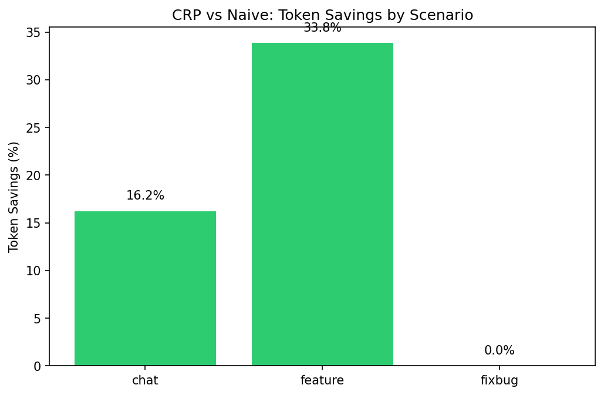
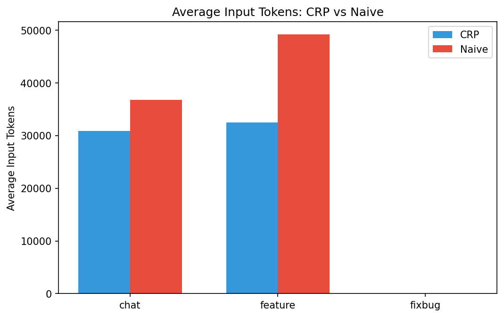

# CRP Token Efficiency Experiment Report

**Total Records**: 40
**Overall Savings**: 25.04%

## Scenario Results

| Scenario | CRP Avg | Naive Avg | Savings % | p-value | Significant? |
|----------|---------|-----------|-----------|---------|--------------|
| chat | 30837.0 | 36811.43 | 16.23% | 0.6223 | No |
| feature | 32525.0 | 49164.12 | 33.84% | 0.3231 | No |
| fixbug | N/A | N/A | N/A% | N/A | No |

## Charts

### Savings


### Avg Tokens


## Statistical Details

```json
{
  "total_records": 40,
  "scenarios": {
    "chat": {
      "scenario": "chat",
      "crp_count": 7,
      "naive_count": 7,
      "crp_avg_input": 30837.0,
      "naive_avg_input": 36811.43,
      "crp_std_input": 23979.21,
      "naive_std_input": 28865.33,
      "savings_percent": 16.23,
      "paired_diff_mean": -3672.0,
      "paired_diff_std": 17145.71,
      "paired_n": 6,
      "t_statistic": -0.5245932592425723,
      "p_value": 0.6222841629981164,
      "significant": false
    },
    "feature": {
      "scenario": "feature",
      "crp_count": 7,
      "naive_count": 8,
      "crp_avg_input": 32525.0,
      "naive_avg_input": 49164.12,
      "crp_std_input": 26189.65,
      "naive_std_input": 21085.36,
      "savings_percent": 33.84,
      "paired_diff_mean": 10715.57,
      "paired_diff_std": 26339.39,
      "paired_n": 7,
      "t_statistic": 1.0763627051826028,
      "p_value": 0.32312880622041584,
      "significant": false
    },
    "fixbug": {
      "scenario": "fixbug",
      "error": "Insufficient data for comparison",
      "crp_count": 3,
      "naive_count": 0
    }
  },
  "overall_savings": 25.04
}
```

## Comparison with Static Estimate

The static analysis from `scripts/token-audit.py` predicted ~77% savings.
The live experiment results are shown above.

## Limitations

- Token parsing relies on Claude Code output format (may change)
- 10 repetitions per scenario provides moderate statistical power
- Per-turn spawning may not capture full session context effects
