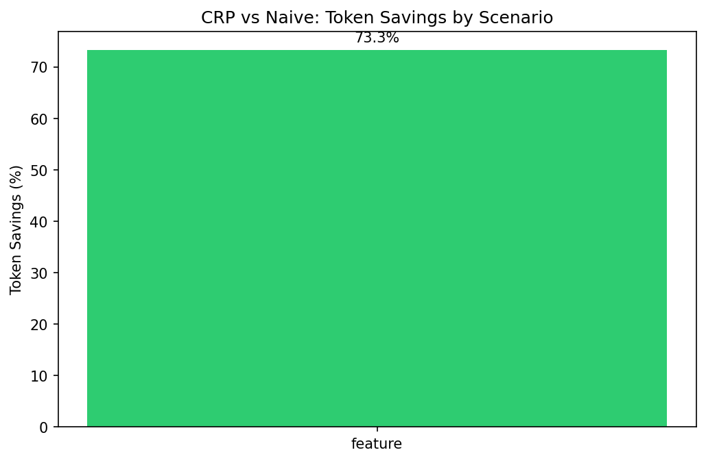
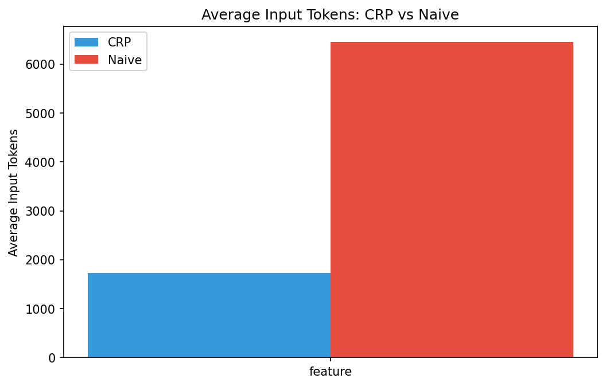

# CRP Token Efficiency Experiment Report

**Total Records**: 16
**Overall Savings**: 73.26%

## Scenario Results

| Scenario | CRP Avg | Naive Avg | Savings % | p-value | Significant? |
|----------|---------|-----------|-----------|---------|--------------|
| feature | 1725.0 | 6450.0 | 73.26% | 0.0000 | Yes |

## Charts

### Savings


### Avg Tokens


## Statistical Details

```json
{
  "total_records": 16,
  "scenarios": {
    "feature": {
      "scenario": "feature",
      "crp_count": 8,
      "naive_count": 8,
      "crp_avg_input": 1725.0,
      "naive_avg_input": 6450.0,
      "crp_std_input": 122.47,
      "naive_std_input": 244.95,
      "savings_percent": 73.26,
      "paired_diff_mean": 4725.0,
      "paired_diff_std": 122.47,
      "paired_n": 8,
      "t_statistic": 109.11920087683927,
      "p_value": 1.4311095250638743e-12,
      "significant": true
    }
  },
  "overall_savings": 73.26
}
```

## Comparison with Static Estimate

The static analysis from `scripts/token-audit.py` predicted ~77% savings.
The live experiment results are shown above.

## Limitations

- Token parsing relies on Claude Code output format (may change)
- 10 repetitions per scenario provides moderate statistical power
- Per-turn spawning may not capture full session context effects
